# 🧪 KatanA Rendering Regression Test

This document is a comprehensive sample that exercises every rendering
feature of KatanA. Open it in KatanA's preview pane to visually verify
that all elements render correctly.

<p align="center">
  English | <a href="sample.ja.md">日本語</a>
</p>

---

## 1. HTML Centering (Past Bug: Elements Left-Aligned Instead of Centered)

### 1.1 `<h1 align="center">` — Centered Heading

<h1 align="center">KatanA Desktop</h1>

↑ The heading "KatanA Desktop" should be **horizontally centered** in the panel.

### 1.2 `<p align="center">` — Centered Paragraph

<p align="center">
  A fast, lightweight Markdown workspace for macOS — built with Rust and egui.
</p>

↑ The description text should be **horizontally centered** in the panel.

### 1.3 Multiple Consecutive Centered Blocks

<h1 align="center">Centered Heading</h1>

<p align="center">
  Centered description paragraph.
</p>

<p align="center">
  Second centered paragraph — should NOT overlap with the first one.
</p>

↑ All three elements should be on separate lines, all centered.

### 1.4 Badge Row (Multiple Link Images on Same Line)

<p align="center">
  <a href="#"></a>
  <a href="#"></a>
  <a href="#"></a>
</p>

↑ Three badges should appear on the **same line**, centered.
(If they are on separate lines, that's a bug.)

### 1.5 Mixed Text + Link Centering

<p align="center">
  English | <a href="#">日本語</a>
</p>

↑ "English | 日本語" should appear on the same line, centered.

### 1.6 Full README Header Reproduction

<p align="center">
  
</p>

<h1 align="center">KatanA Desktop</h1>

<p align="center">
  A fast, lightweight Markdown workspace for macOS
</p>

<p align="center">
  <a href="#"></a>
  <a href="#"></a>
</p>

<p align="center">
  English | <a href="#">日本語</a>
</p>

↑ Icon → heading → description → badges → language selector, all centered in order.

---

## 2. Basic Markdown Elements

### 2.1 Heading Levels

# H1 Heading
## H2 Heading
### H3 Heading
#### H4 Heading
##### H5 Heading
###### H6 Heading

### 2.2 Text Decoration

- **Bold text**
- *Italic text*
- ~~Strikethrough~~
- `Inline code`
- **Bold and *italic* mixed**

### 2.3 Links

- [Normal link](https://github.com)
- [Email link](mailto:test@example.com)
- Autolink: https://github.com

### 2.4 Horizontal Rule

Text above

---

Text below

---

## 3. Lists

### 3.1 Unordered Lists

- Item 1
- Item 2
  - Nested item 2-1
  - Nested item 2-2
    - Deeply nested 2-2-1
- Item 3

### 3.2 Ordered Lists

1. First item
2. Second item
   1. Nested 2-1
   2. Nested 2-2
3. Third item

### 3.3 Task Lists

- [x] Completed task
- [ ] Pending task
- [x] Another completed task
  - [ ] Nested pending
  - [x] Nested completed

---

## 4. Code Blocks

### 4.1 Basic Code Block

```rust
fn main() {
    println!("Hello, KatanA!");
}
```

### 4.2 Code Block Without Language

```
This is a code block without language specification.
No syntax highlighting should be applied.
```

### 4.3 Multiple Languages

```python
def hello():
    print("Hello from Python")
```

```javascript
function hello() {
    console.log("Hello from JavaScript");
}
```

```json
{
  "name": "katana",
  "version": "0.0.2",
  "features": ["markdown", "diagrams"]
}
```

```yaml
name: KatanA
version: 0.0.2
features:
  - markdown
  - diagrams
```

### 4.4 Code Block Inside List (Past Bug: Incorrect Rendering)

1. First step:

   ```sh
   cargo build --release
   ```

2. Second step:

   ```sh
   ./target/release/KatanA
   ```

3. Verify:
   - Sub-item A
   - Sub-item B

↑ Code blocks should be correctly indented within list items.

### 4.5 Code Block Inside Nested List

- Outer item
  - Inner item

    ```rust
    let x = 42;
    println!("{}", x);
    ```

  - Continuation

↑ Code block should not break the nested list layout.

---

## 5. Tables (GFM)

### 5.1 Basic Table

| Feature | Status | Notes |
|---------|--------|-------|
| Markdown | ✅ | Full support |
| Mermaid | ✅ | Requires mmdc |
| PlantUML | ✅ | Requires jar |
| DrawIo | ✅ | Pure Rust |

### 5.2 Table with Alignment

| Left | Center | Right |
|:-----|:------:|------:|
| text | text | text |
| longer text | short | 12345 |

### 5.3 Single Row Table

| Header |
|--------|
| Content |

---

## 6. Blockquotes

### 6.1 Basic Quote

> This is a blockquote.
> It can span multiple lines.

### 6.2 Nested Quotes

> Outer quote
> > Inner quote
> > > Even deeper

### 6.3 Decorated Quote

> **Bold quote**
>
> - List item 1
> - List item 2
>
> ```rust
> let quoted_code = true;
> ```

---

## 7. Diagrams — Mermaid

### 7.1 Flowchart

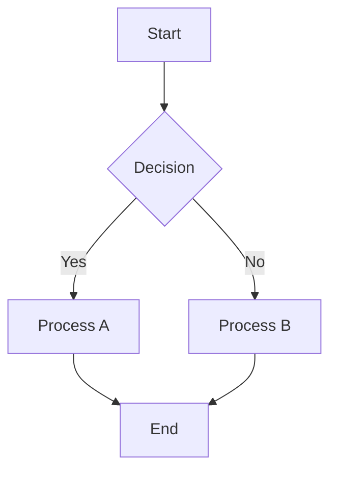

### 7.2 Sequence Diagram

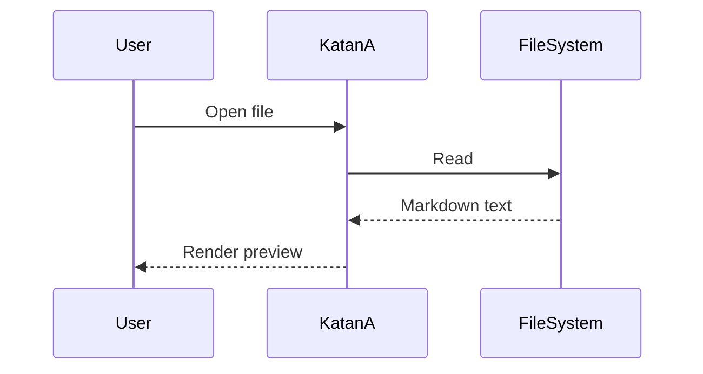

### 7.3 Class Diagram

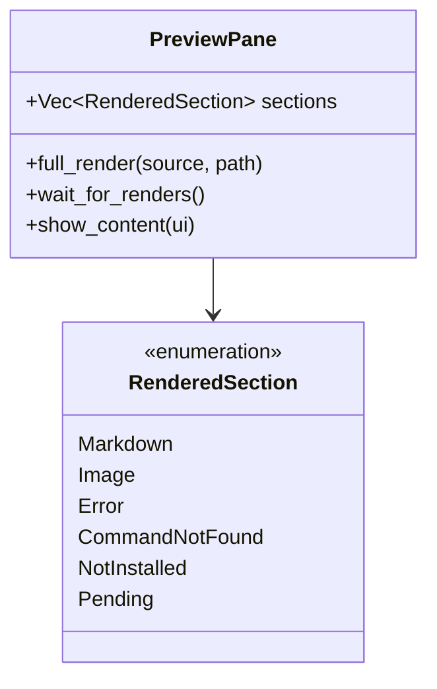

### 7.4 State Diagram

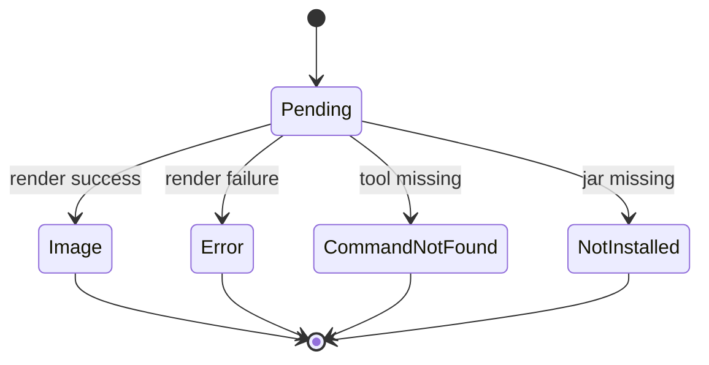

### 7.5 Gantt Chart

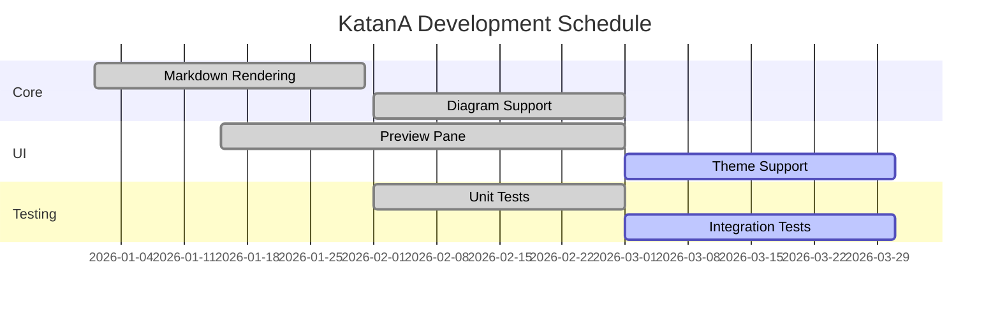

---

## 8. Diagrams — PlantUML

### 8.1 Sequence Diagram

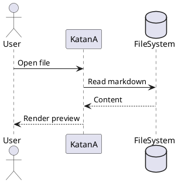

### 8.2 Class Diagram

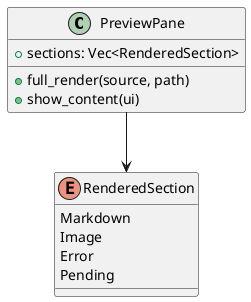

### 8.3 Activity Diagram

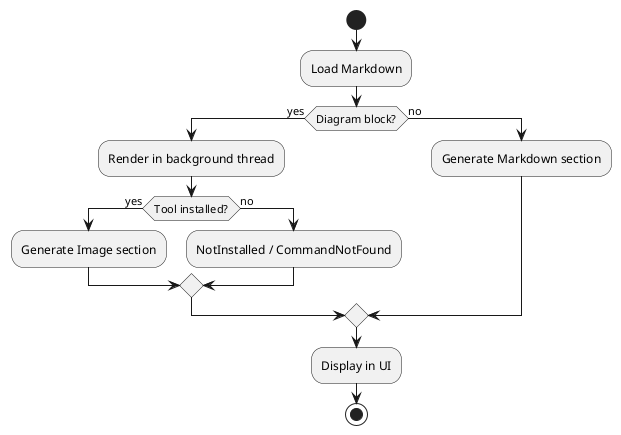

---

## 9. Diagrams — DrawIo

### 9.1 Basic Shapes

```drawio
<mxGraphModel>
  <root>
    <mxCell id="0"/>
    <mxCell id="1" parent="0"/>
    <mxCell id="2" value="Hello" style="rounded=1;fillColor=#dae8fc;strokeColor=#6c8ebf;" vertex="1" parent="1">
      <mxGeometry x="50" y="50" width="120" height="60" as="geometry"/>
    </mxCell>
    <mxCell id="3" value="World" style="ellipse;fillColor=#d5e8d4;strokeColor=#82b366;" vertex="1" parent="1">
      <mxGeometry x="250" y="50" width="120" height="60" as="geometry"/>
    </mxCell>
    <mxCell id="4" style="edgeStyle=orthogonalEdgeStyle;" edge="1" source="2" target="3" parent="1">
      <mxGeometry relative="1" as="geometry"/>
    </mxCell>
  </root>
</mxGraphModel>
```

### 9.2 Multiple Shapes with Connections

```drawio
<mxGraphModel>
  <root>
    <mxCell id="0"/>
    <mxCell id="1" parent="0"/>
    <mxCell id="2" value="Input" style="shape=parallelogram;fillColor=#fff2cc;strokeColor=#d6b656;" vertex="1" parent="1">
      <mxGeometry x="50" y="30" width="120" height="50" as="geometry"/>
    </mxCell>
    <mxCell id="3" value="Process" style="rounded=1;fillColor=#dae8fc;strokeColor=#6c8ebf;" vertex="1" parent="1">
      <mxGeometry x="50" y="120" width="120" height="50" as="geometry"/>
    </mxCell>
    <mxCell id="4" value="Output" style="shape=parallelogram;fillColor=#d5e8d4;strokeColor=#82b366;" vertex="1" parent="1">
      <mxGeometry x="50" y="210" width="120" height="50" as="geometry"/>
    </mxCell>
    <mxCell id="5" edge="1" source="2" target="3" parent="1">
      <mxGeometry relative="1" as="geometry"/>
    </mxCell>
    <mxCell id="6" edge="1" source="3" target="4" parent="1">
      <mxGeometry relative="1" as="geometry"/>
    </mxCell>
  </root>
</mxGraphModel>
```

---

## 10. Mixed Content (Past Bug: Section Boundary Breaking)

Markdown text, diagrams, code blocks, and tables mixed together.
Verify no layout overlap between sections.

### Architecture Overview

KatanA rendering pipeline:

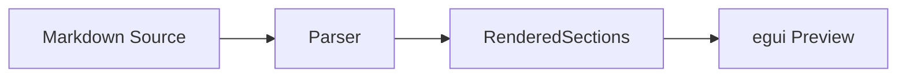

Proper spacing between the flowchart above and this text.

| Component | Role |
|---|---|
| `PreviewPane` | Section management |
| `show_content` | UI rendering |

Proper spacing between the table above and the code block below.

```rust
enum RenderedSection {
    Markdown(String),
    Image { svg_data: RasterizedSvg, alt: String },
    Error { kind: String, message: String },
    CommandNotFound { tool_name: String },
    NotInstalled { kind: String },
    Pending { kind: String },
}
```

And a DrawIo diagram below:

```drawio
<mxGraphModel>
  <root>
    <mxCell id="0"/>
    <mxCell id="1" parent="0"/>
    <mxCell id="2" value="Mixed Content Test" style="rounded=1;fillColor=#f8cecc;strokeColor=#b85450;" vertex="1" parent="1">
      <mxGeometry x="50" y="30" width="200" height="60" as="geometry"/>
    </mxCell>
  </root>
</mxGraphModel>
```

↑ All sections should render correctly without overlapping.

---

## 11. Edge Cases

### 11.1 Empty Code Block

```
```

### 11.2 Very Long Line

`This is a very long line to verify horizontal scrolling or word wrapping. ABCDEFGHIJKLMNOPQRSTUVWXYZabcdefghijklmnopqrstuvwxyz0123456789 repeated. ABCDEFGHIJKLMNOPQRSTUVWXYZabcdefghijklmnopqrstuvwxyz0123456789`

### 11.3 Special Characters

- HTML entities: &amp; &lt; &gt; &quot;
- Japanese: こんにちは世界 🌍
- Emoji: 🦀 ⚡ 📝 🔧 ✅ ❌ ⚠️ 💡
- Math symbols: α β γ δ ∑ ∫ √ ∞

### 11.4 Footnotes

This text has a footnote[^1]. Here's another[^2].

[^1]: First footnote content.
[^2]: Second footnote content.

### 11.5 Consecutive Different Block Elements

> A blockquote

```rust
let code = "directly after quote";
```

- A list item directly after code block

| Header |
|--------|
| Table after list |

↑ Proper spacing between each block element.

---

## 12. Consecutive Diagrams

Three diagram types in a row. One failing should not affect the others.

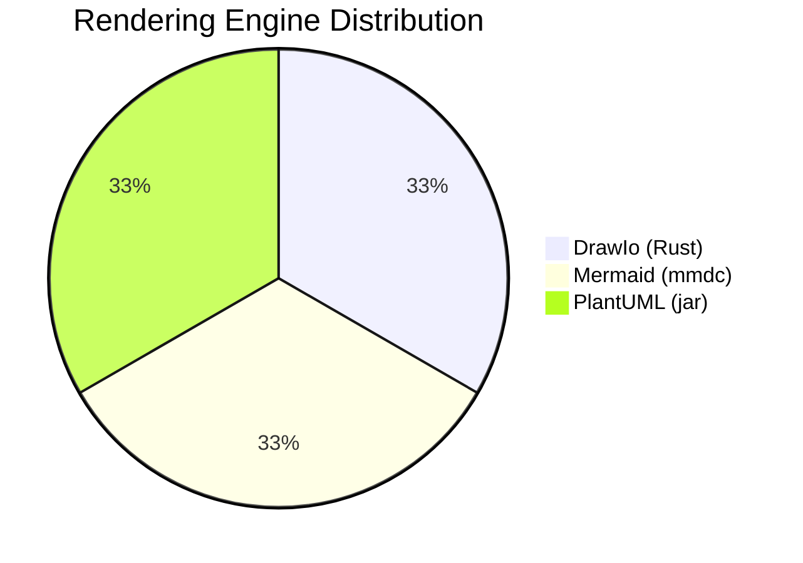

```drawio
<mxGraphModel>
  <root>
    <mxCell id="0"/>
    <mxCell id="1" parent="0"/>
    <mxCell id="2" value="Between Diagrams" style="rounded=1;" vertex="1" parent="1">
      <mxGeometry x="50" y="30" width="150" height="50" as="geometry"/>
    </mxCell>
  </root>
</mxGraphModel>
```

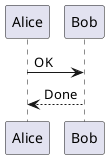

↑ All three diagrams rendered independently with proper spacing.

---

## ✅ Verification Complete

If all sections above render correctly, there are no rendering regressions.
