# 🧪 KatanA 描画 — ダイアグラム（外部依存）

このフィクスチャは外部ツール依存のダイアグラム描画を検証します：
Mermaid (mmdc)、PlantUML (jar)、DrawIo (純Rust)。

<p align="center">
  <a href="sample_diagrams.md">English</a> | 日本語
</p>

---

## 7. ダイアグラム — Mermaid

### 7.1 フローチャート

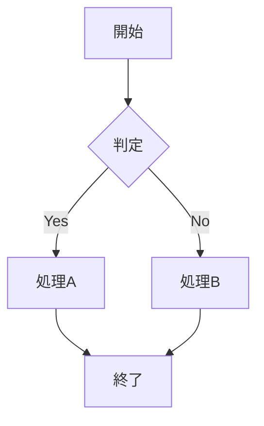

### 7.2 シーケンス図

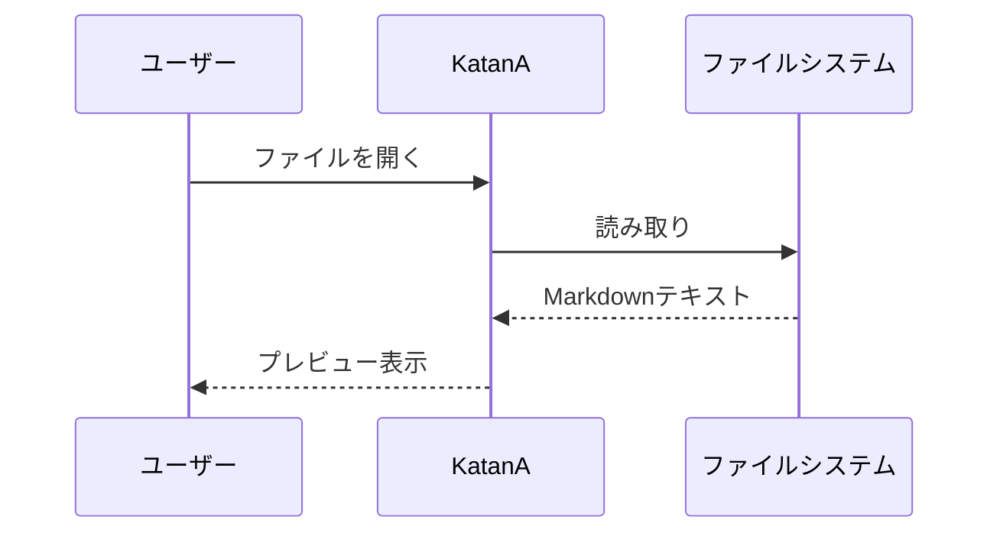

### 7.3 クラス図

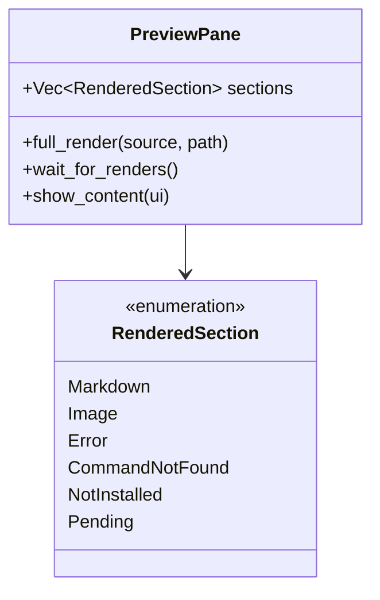

### 7.4 状態遷移図

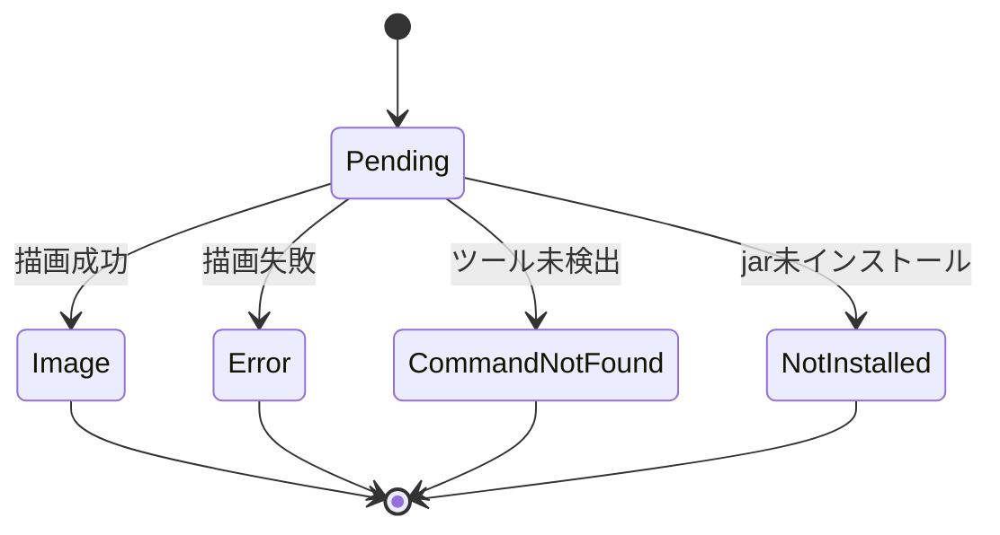

### 7.5 ガントチャート

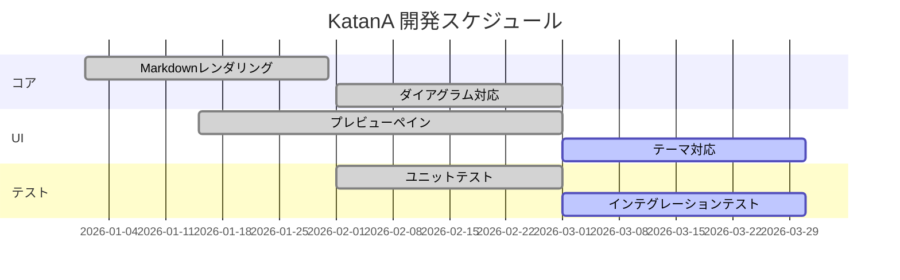

---

## 8. ダイアグラム — PlantUML

### 8.1 シーケンス図

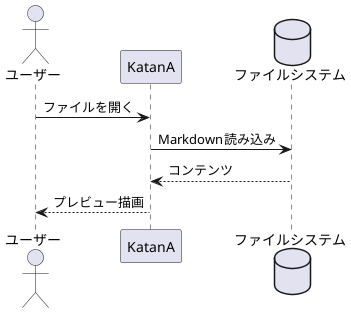

### 8.2 クラス図

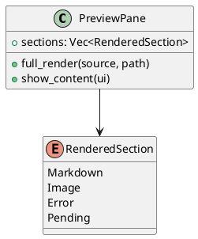

### 8.3 アクティビティ図

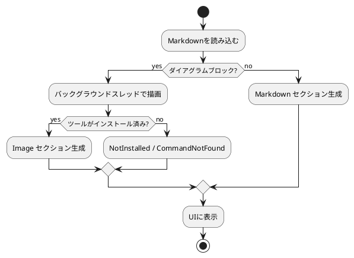

---

## 9. ダイアグラム — DrawIo

### 9.1 基本図形

```drawio
<mxGraphModel>
  <root>
    <mxCell id="0"/>
    <mxCell id="1" parent="0"/>
    <mxCell id="2" value="Hello" style="rounded=1;fillColor=#dae8fc;strokeColor=#6c8ebf;" vertex="1" parent="1">
      <mxGeometry x="50" y="50" width="120" height="60" as="geometry"/>
    </mxCell>
    <mxCell id="3" value="World" style="ellipse;fillColor=#d5e8d4;strokeColor=#82b366;" vertex="1" parent="1">
      <mxGeometry x="250" y="50" width="120" height="60" as="geometry"/>
    </mxCell>
    <mxCell id="4" style="edgeStyle=orthogonalEdgeStyle;" edge="1" source="2" target="3" parent="1">
      <mxGeometry relative="1" as="geometry"/>
    </mxCell>
  </root>
</mxGraphModel>
```

### 9.2 複数の図形と接続

```drawio
<mxGraphModel>
  <root>
    <mxCell id="0"/>
    <mxCell id="1" parent="0"/>
    <mxCell id="2" value="入力" style="shape=parallelogram;fillColor=#fff2cc;strokeColor=#d6b656;" vertex="1" parent="1">
      <mxGeometry x="50" y="30" width="120" height="50" as="geometry"/>
    </mxCell>
    <mxCell id="3" value="処理" style="rounded=1;fillColor=#dae8fc;strokeColor=#6c8ebf;" vertex="1" parent="1">
      <mxGeometry x="50" y="120" width="120" height="50" as="geometry"/>
    </mxCell>
    <mxCell id="4" value="出力" style="shape=parallelogram;fillColor=#d5e8d4;strokeColor=#82b366;" vertex="1" parent="1">
      <mxGeometry x="50" y="210" width="120" height="50" as="geometry"/>
    </mxCell>
    <mxCell id="5" edge="1" source="2" target="3" parent="1">
      <mxGeometry relative="1" as="geometry"/>
    </mxCell>
    <mxCell id="6" edge="1" source="3" target="4" parent="1">
      <mxGeometry relative="1" as="geometry"/>
    </mxCell>
  </root>
</mxGraphModel>
```

---

## 10. ダイアグラム混在コンテンツ

KatanA の描画パイプライン:

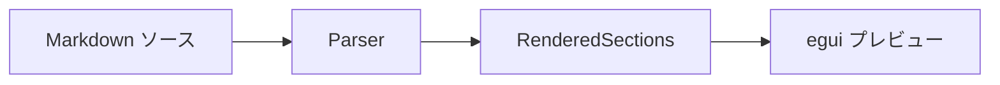

上のフローチャートとこのテキストの間にスペースがあること。

そして下に DrawIo:

```drawio
<mxGraphModel>
  <root>
    <mxCell id="0"/>
    <mxCell id="1" parent="0"/>
    <mxCell id="2" value="混在コンテンツテスト" style="rounded=1;fillColor=#f8cecc;strokeColor=#b85450;" vertex="1" parent="1">
      <mxGeometry x="50" y="30" width="200" height="60" as="geometry"/>
    </mxCell>
  </root>
</mxGraphModel>
```

↑ すべてのセクションが正しく描画され、互いに重ならないこと。

---

## 12. 複数ダイアグラム連続表示

3種類のダイアグラムを連続で配置。1つの失敗が他に影響しないこと。

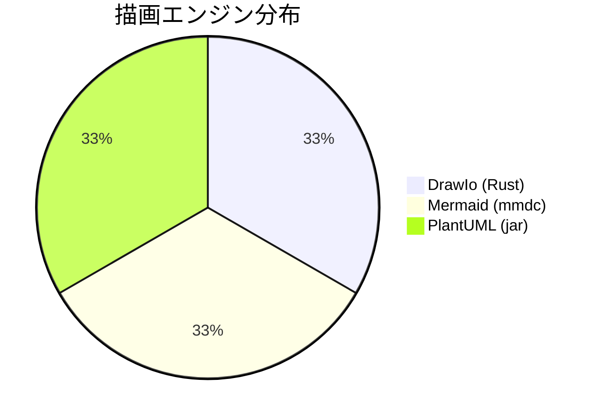

```drawio
<mxGraphModel>
  <root>
    <mxCell id="0"/>
    <mxCell id="1" parent="0"/>
    <mxCell id="2" value="ダイアグラム間" style="rounded=1;" vertex="1" parent="1">
      <mxGeometry x="50" y="30" width="150" height="50" as="geometry"/>
    </mxCell>
  </root>
</mxGraphModel>
```

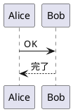

↑ 3つのダイアグラムがそれぞれ独立して描画され、
テキストなしでも正しくスペーシングされること。

---

## ✅ 検証完了

すべてのセクションが正しく表示されていれば、ダイアグラム描画は正常です。
