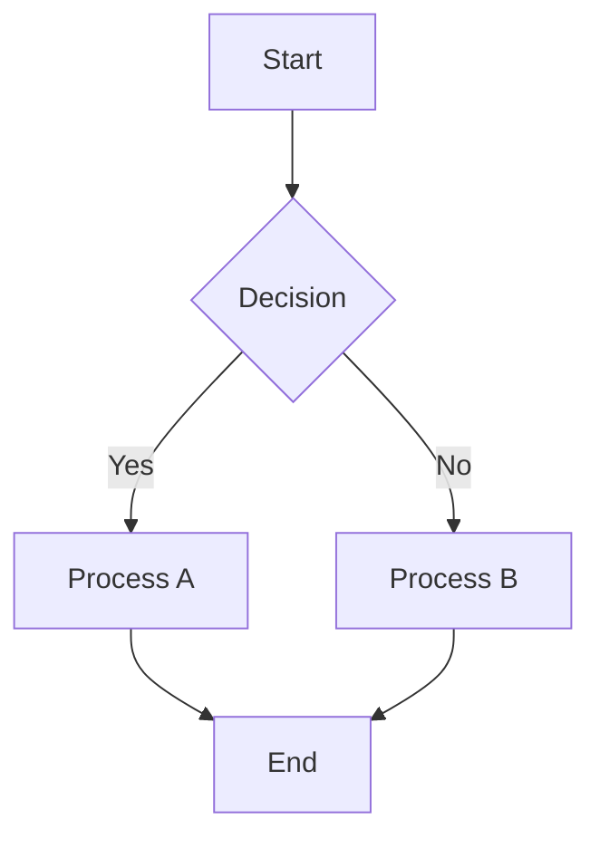
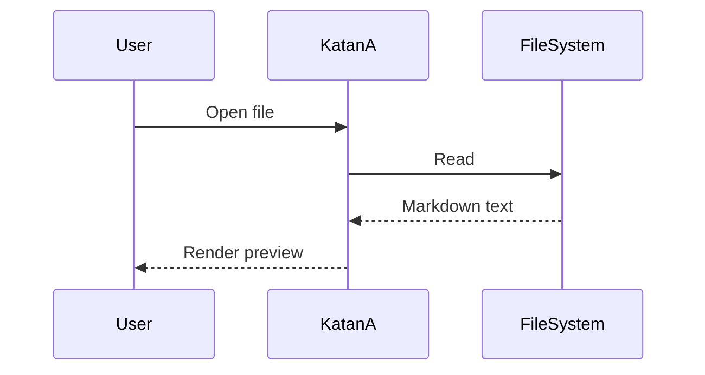
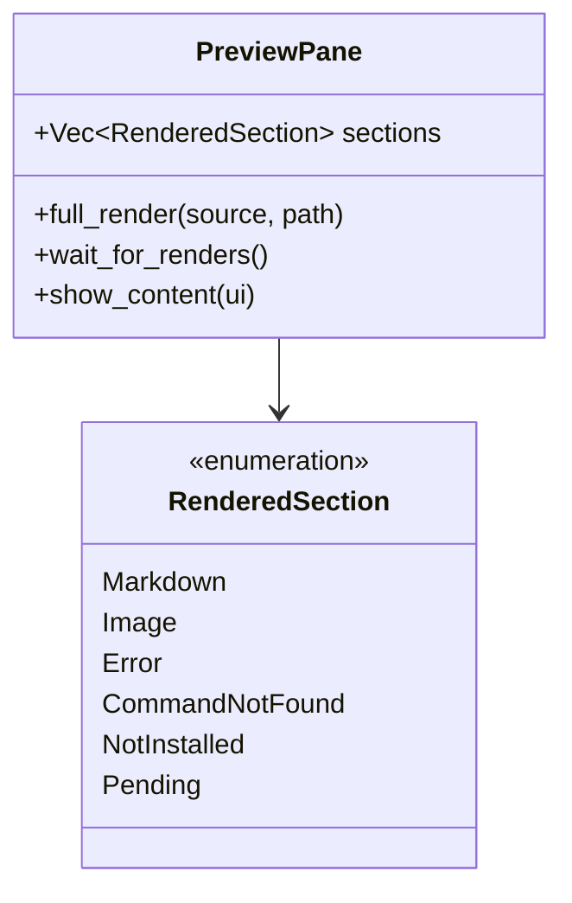
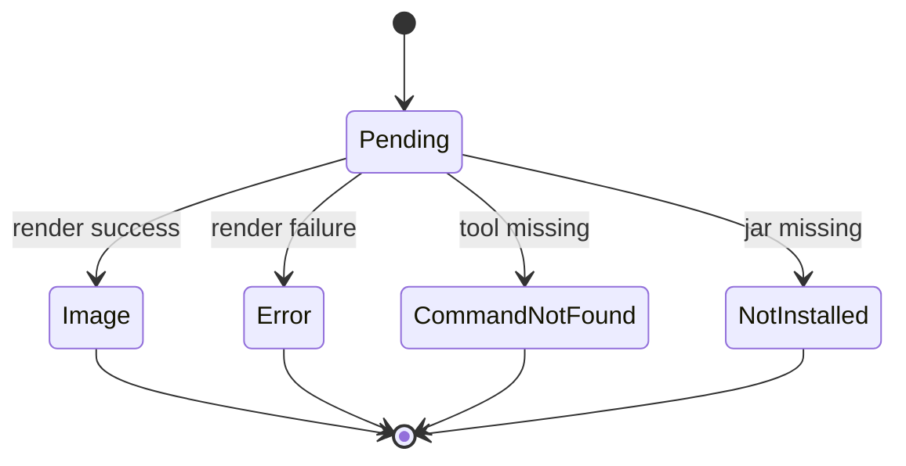
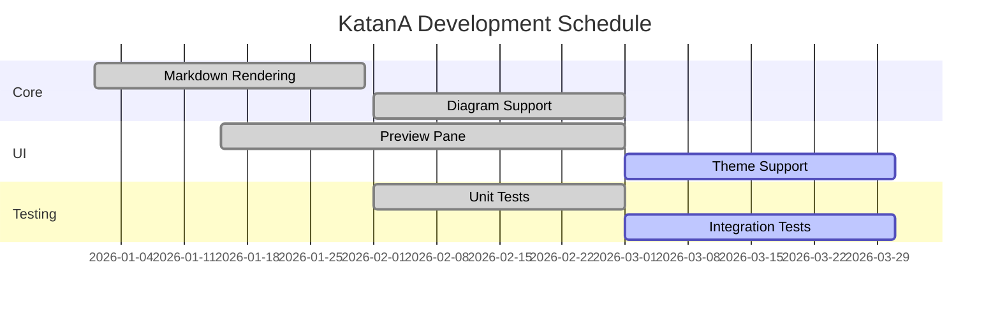
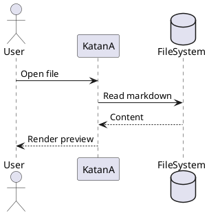
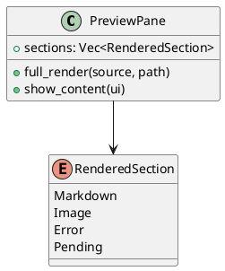
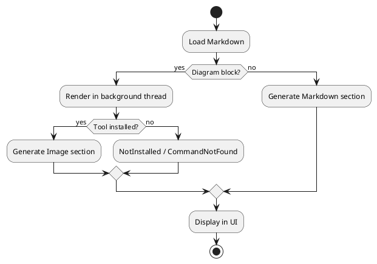
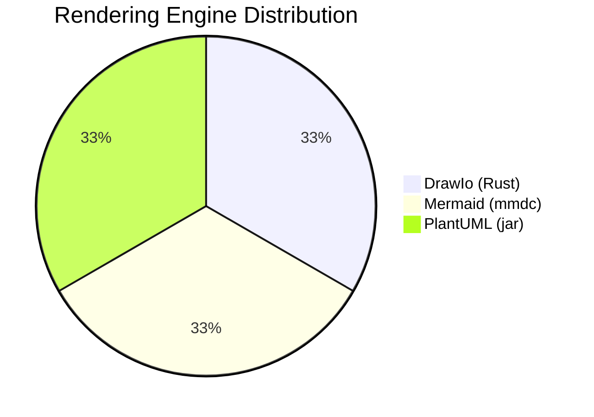
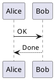

# 🧪 KatanA Rendering — Diagrams (External Dependencies)

This fixture exercises diagram rendering that depends on external tools:
Mermaid (mmdc), PlantUML (jar), and DrawIo (Pure Rust).

<p align="center">
  English | <a href="sample_diagrams.ja.md">日本語</a>
</p>

---

## 7. Diagrams — Mermaid

### 7.1 Flowchart



### 7.2 Sequence Diagram



### 7.3 Class Diagram



### 7.4 State Diagram



### 7.5 Gantt Chart



---

## 8. Diagrams — PlantUML

### 8.1 Sequence Diagram



### 8.2 Class Diagram



### 8.3 Activity Diagram



---

## 9. Diagrams — DrawIo

### 9.1 Basic Shapes

```drawio
<mxGraphModel>
  <root>
    <mxCell id="0"/>
    <mxCell id="1" parent="0"/>
    <mxCell id="2" value="Hello" style="rounded=1;fillColor=#dae8fc;strokeColor=#6c8ebf;" vertex="1" parent="1">
      <mxGeometry x="50" y="50" width="120" height="60" as="geometry"/>
    </mxCell>
    <mxCell id="3" value="World" style="ellipse;fillColor=#d5e8d4;strokeColor=#82b366;" vertex="1" parent="1">
      <mxGeometry x="250" y="50" width="120" height="60" as="geometry"/>
    </mxCell>
    <mxCell id="4" style="edgeStyle=orthogonalEdgeStyle;" edge="1" source="2" target="3" parent="1">
      <mxGeometry relative="1" as="geometry"/>
    </mxCell>
  </root>
</mxGraphModel>
```

### 9.2 Multiple Shapes with Connections

```drawio
<mxGraphModel>
  <root>
    <mxCell id="0"/>
    <mxCell id="1" parent="0"/>
    <mxCell id="2" value="Input" style="shape=parallelogram;fillColor=#fff2cc;strokeColor=#d6b656;" vertex="1" parent="1">
      <mxGeometry x="50" y="30" width="120" height="50" as="geometry"/>
    </mxCell>
    <mxCell id="3" value="Process" style="rounded=1;fillColor=#dae8fc;strokeColor=#6c8ebf;" vertex="1" parent="1">
      <mxGeometry x="50" y="120" width="120" height="50" as="geometry"/>
    </mxCell>
    <mxCell id="4" value="Output" style="shape=parallelogram;fillColor=#d5e8d4;strokeColor=#82b366;" vertex="1" parent="1">
      <mxGeometry x="50" y="210" width="120" height="50" as="geometry"/>
    </mxCell>
    <mxCell id="5" edge="1" source="2" target="3" parent="1">
      <mxGeometry relative="1" as="geometry"/>
    </mxCell>
    <mxCell id="6" edge="1" source="3" target="4" parent="1">
      <mxGeometry relative="1" as="geometry"/>
    </mxCell>
  </root>
</mxGraphModel>
```

---

## 10. Mixed Content with Diagrams

KatanA rendering pipeline:


Proper spacing between the flowchart above and this text.

And a DrawIo diagram below:

```drawio
<mxGraphModel>
  <root>
    <mxCell id="0"/>
    <mxCell id="1" parent="0"/>
    <mxCell id="2" value="Mixed Content Test" style="rounded=1;fillColor=#f8cecc;strokeColor=#b85450;" vertex="1" parent="1">
      <mxGeometry x="50" y="30" width="200" height="60" as="geometry"/>
    </mxCell>
  </root>
</mxGraphModel>
```

↑ All sections should render correctly without overlapping.

---

## 12. Consecutive Diagrams

Three diagram types in a row. One failing should not affect the others.



```drawio
<mxGraphModel>
  <root>
    <mxCell id="0"/>
    <mxCell id="1" parent="0"/>
    <mxCell id="2" value="Between Diagrams" style="rounded=1;" vertex="1" parent="1">
      <mxGeometry x="50" y="30" width="150" height="50" as="geometry"/>
    </mxCell>
  </root>
</mxGraphModel>
```



↑ All three diagrams rendered independently with proper spacing.

---

## ✅ Verification Complete

If all sections above render correctly, diagram rendering is working.
