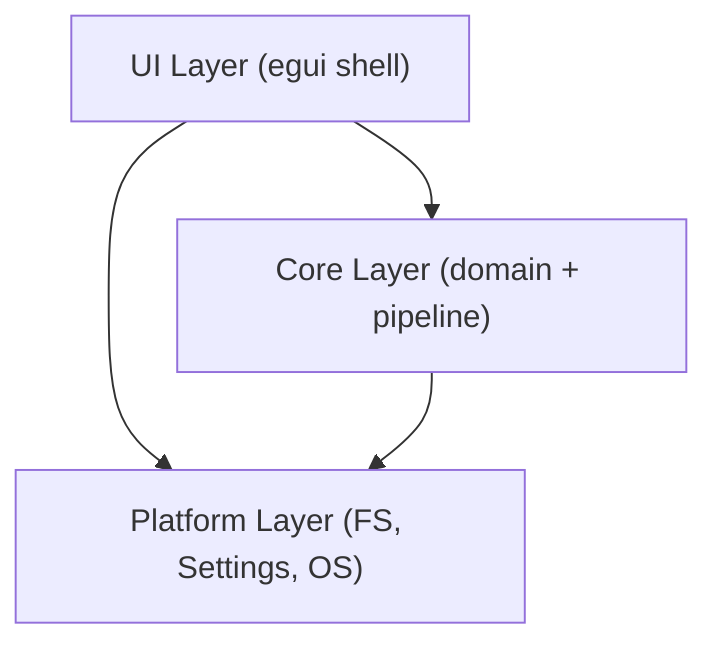

# Architecture

This document describes the overall architecture of the sample project.

## Component Diagram

The system is divided into three layers:

日本語テスト

## Layer Responsibilities

| Layer    | Responsibility                                      |
|----------|-----------------------------------------------------|
| UI       | Pane layout, user interaction, action dispatch      |
| Core     | Document model, Markdown pipeline, AI/plugin seams  |
| Platform | Filesystem I/O, settings persistence, OS services   |
